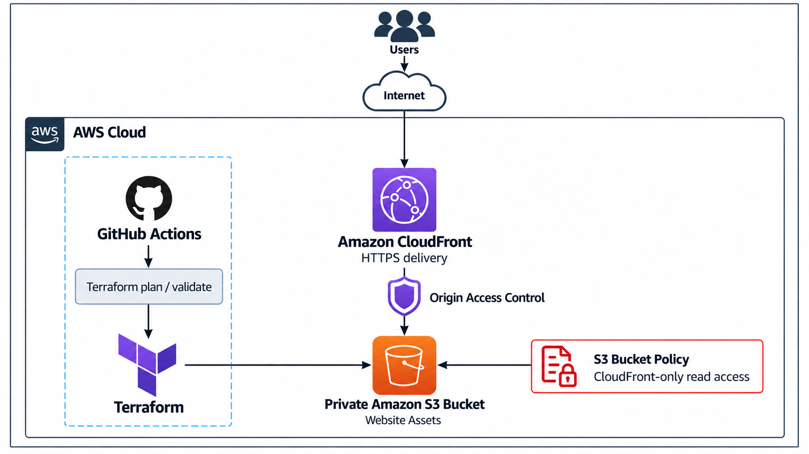

# Course with Project Report

## Programming for Cloud Platform

### HashiCorp Certified: Terraform Associate (003) Cert Prep by KodeKloud

**Student Name:** Devyansh Gupta  
**USN:** 25MCAR0193  
**Semester:** III  
**Specialisation:** SCT  
**Date of Submission:** 27-09-2026  

---

# Certificate

This is to certify that Mr. Devyansh Gupta has satisfactorily completed the activity prescribed by JAIN (Deemed to be University) for the Third semester degree course in the year 2026.

The activity is based on the LinkedIn Learning course **HashiCorp Certified: Terraform Associate (003) Cert Prep by KodeKloud** and its accompanying Terraform cloud platform project.

**Student Signature:** ____________________  
**Faculty Signature:** ____________________

---

# Index

1. Course Summary
2. Course Learning Outcomes
3. Course Completion Certificate
4. Project Summary
5. Project Architecture
6. Steps of Implementation
7. Output
8. GitHub Proof Link
9. Conclusion
10. References

---

# 1. Course Summary

## Course Details

- **Course:** HashiCorp Certified: Terraform Associate (003) Cert Prep by KodeKloud
- **Platform:** LinkedIn Learning
- **Course Link:** https://www.linkedin.com/learning/hashicorp-certified-terraform-associate-003-cert-prep-by-kodekloud/
- **Duration:** 3 hours 10 minutes
- **Level:** Intermediate
- **Completed by:** Devyansh Gupta
- **Completion Date:** 20 September 2026
- **Skills Covered:** DevOps and Terraform

This course prepares learners for the HashiCorp Certified: Terraform Associate (003) examination. It explains the fundamentals of Infrastructure as Code and provides practical knowledge of Terraform configuration, providers, resources, variables, outputs, state management, modules, imports, workspaces, logging, Terraform Cloud, and the Terraform CLI.

The course also demonstrates how Terraform can be used to create, modify, manage, and destroy infrastructure in a predictable and repeatable way.

## Course Topics

- Infrastructure as Code concepts
- Terraform workflow and lifecycle
- Terraform providers and resources
- Input variables and output values
- Terraform state and state locking
- Terraform modules
- Terraform import
- Terraform workspaces
- Terraform logging and troubleshooting
- Terraform Cloud
- Terraform plan and apply workflows

## Course Screenshot

Insert the supplied course screenshot here.

**Figure 1:** LinkedIn Learning course content showing Terraform modules and Terraform Cloud topics.

---

# 2. Course Learning Outcomes

## Infrastructure as Code

The course explains how infrastructure can be represented as version-controlled configuration files. This makes infrastructure repeatable, reviewable, and easier to manage.

## Terraform Workflow

The course covers the major Terraform commands:

```text
terraform init
terraform fmt
terraform validate
terraform plan
terraform apply
terraform show
terraform output
terraform destroy
```

## State Management

Terraform state records the relationship between configuration files and deployed infrastructure. The course explains state files, remote state, state locking, drift, and the importance of protecting state data.

## Reusable Configuration

Variables, outputs, modules, expressions, and provider configuration make Terraform projects easier to reuse and maintain.

## Operational Confidence

The course develops the ability to read Terraform plans, understand resource dependencies, import existing resources, troubleshoot errors, and manage infrastructure changes safely.

The project described in this report applies these learning outcomes by defining a secure AWS static website platform with Terraform.

---

# 3. Course Completion Certificate

- **Course:** HashiCorp Certified: Terraform Associate (003) Cert Prep by KodeKloud
- **Learner:** Devyansh Gupta
- **Completion Date:** 20 September 2026
- **Completion Time:** 06:50 PM UTC
- **Duration:** 3 hours 10 minutes
- **Top Skills:** DevOps, Terraform
- **Certificate ID:** `98f20bbe44e7daad5af0259b59fc24ebc3e37489225625644fb6854138dd6646`

Insert the supplied LinkedIn Learning certificate here if required.

---

# 4. Project Summary

## Project Title

## Terraform Cloud Platform for a Secure Static Website

## Problem Statement

Manually creating a website hosting platform is repetitive, difficult to audit, and prone to configuration drift. Manual configuration also makes it difficult to reproduce the same environment across multiple stages.

This project solves the problem by defining the infrastructure as Terraform code. The configuration can be reviewed, version-controlled, validated, and reproduced consistently.

## Project Objective

The objective is to provision a secure static website platform on AWS using:

- Amazon S3 for website asset storage
- Amazon CloudFront for HTTPS delivery and caching
- CloudFront Origin Access Control for secure access to S3
- An S3 bucket policy that permits access only through CloudFront
- Terraform variables and outputs for reusable configuration
- GitHub Actions for automated Terraform validation

## Project Scope

The project contains:

- Terraform provider and version constraints
- AWS provider configuration
- Configurable project variables
- A private S3 bucket
- S3 public access blocking
- S3 versioning
- CloudFront distribution
- CloudFront Origin Access Control
- IAM policy document
- S3 bucket policy
- Terraform outputs
- Sample website content
- GitHub Actions validation workflow
- Project documentation

---

# 5. Project Architecture

```text
Developer
    |
    v
GitHub Repository
    |
    v
Terraform Configuration
    |
    +----------------------+
    |                      |
    v                      v
Amazon S3              Amazon CloudFront
Private Website Origin HTTPS Delivery Layer
    |                      |
    +----------<-----------+
       Origin Access Control
```



**Figure 2:** Terraform, GitHub Actions, CloudFront, Origin Access Control, and private S3 website architecture.

## Architecture Components

| Layer | Component | Purpose |
|---|---|---|
| Source | GitHub repository | Version control, collaboration, and submission proof |
| Infrastructure as Code | Terraform | Declarative infrastructure definitions |
| Storage | Amazon S3 | Private storage for website assets |
| Delivery | Amazon CloudFront | HTTPS delivery and caching |
| Security | Origin Access Control and S3 bucket policy | Restricts access to CloudFront |
| Automation | GitHub Actions | Runs Terraform formatting and validation checks |

## Security Design

The S3 bucket blocks public access. The CloudFront distribution uses Origin Access Control with SigV4 signing. The S3 bucket policy permits object reads only for the CloudFront service principal and the configured CloudFront distribution.

---

# 6. Steps of Implementation

1. Define the required Terraform version and AWS provider version.
2. Configure the AWS region and default resource tags.
3. Define variables for the AWS region, project name, environment, and CloudFront price class.
4. Create an S3 bucket for website assets.
5. Enable S3 versioning.
6. Block all public access to the S3 bucket.
7. Create a CloudFront Origin Access Control.
8. Create a CloudFront distribution with HTTPS redirection.
9. Create an IAM policy document that allows CloudFront to read S3 objects.
10. Attach the policy to the S3 bucket.
11. Define Terraform outputs for the bucket name, distribution ID, and CloudFront domain name.
12. Add a sample `index.html` website.
13. Add a GitHub Actions workflow for Terraform formatting and validation.
14. Run Terraform formatting and validation commands.
15. Commit the project and upload it to GitHub.

## Terraform Validation Commands

```powershell
terraform fmt -recursive
terraform init -backend=false
terraform validate
```

## Validation Result

Terraform validation completed successfully:

```text
Success! The configuration is valid.
```

The project was not applied to AWS because applying it requires AWS credentials and creates billable cloud resources. The configuration is ready for an authenticated `terraform plan` and `terraform apply` workflow.

---

# 7. Output

## Expected Terraform Outputs

### `website_bucket_name`

The name of the private S3 bucket containing the website assets.

### `cloudfront_distribution_id`

The identifier of the CloudFront distribution.

### `cloudfront_domain_name`

The HTTPS domain name used to access the deployed website.

## Local Project Evidence

The repository contains:

- Terraform configuration files
- A sample website at `site/index.html`
- Terraform provider lock file
- GitHub Actions workflow
- Project README
- Terraform variable example file

## Expected Result After Deployment

After a successful AWS deployment, users will access the static website through the CloudFront HTTPS domain. Direct public access to the S3 bucket will remain blocked.

---

# 8. GitHub Proof Link

**Repository:** [Terraform Cloud Platform Project](https://github.com/Devyansh-Gupta/terraform-cloud-platform-devyansh-25mcar0193)

- **Repository Owner:** Devyansh-Gupta
- **Repository Visibility:** Private
- **Branch:** `master`
- **Project Type:** Terraform AWS Cloud Platform

The repository contains the complete Terraform source code, sample website, workflow, README, provider lock file, and project configuration.

## Suggested Evaluator Commands

```powershell
terraform init
terraform fmt -check -recursive
terraform validate
terraform plan -var="project_name=devyansh-terraform-demo" -var="environment=dev"
```

---

# 9. Conclusion

The LinkedIn Learning course provided the concepts required to design and operate Terraform configurations. The project applies those concepts to an end-to-end cloud platform in which infrastructure is declared as code, secured through restricted access, exposed through Terraform outputs, validated automatically, and stored in GitHub for review.

The project demonstrates practical understanding of:

- Infrastructure as Code
- Terraform provider configuration
- Variables and outputs
- Resource dependencies
- AWS S3
- AWS CloudFront
- Origin Access Control
- IAM policy configuration
- Terraform validation
- GitHub-based infrastructure workflows

The implementation is ready for a credentialed AWS plan and apply. Keeping the apply step behind explicit approval prevents unexpected resource creation and cost while preserving a complete and reproducible project submission.

**Submitted by:** Devyansh Gupta  
**USN:** 25MCAR0193  
**Date of Submission:** 27-09-26

---

# 10. References

1. LinkedIn Learning, [HashiCorp Certified: Terraform Associate (003) Cert Prep by KodeKloud](https://www.linkedin.com/learning/hashicorp-certified-terraform-associate-003-cert-prep-by-kodekloud/)
2. [HashiCorp Terraform Documentation](https://developer.hashicorp.com/terraform/docs)
3. [HashiCorp AWS Provider Documentation](https://registry.terraform.io/providers/hashicorp/aws/latest/docs)
4. Supplied course completion certificate: `CertificateOfCompletion_HashiCorp Certified Terraform Associate 003 Cert Prep by KodeKloud.pdf`
5. Supplied reference report: `PCP_25MCAR0144_DHRUVI.pdf`
